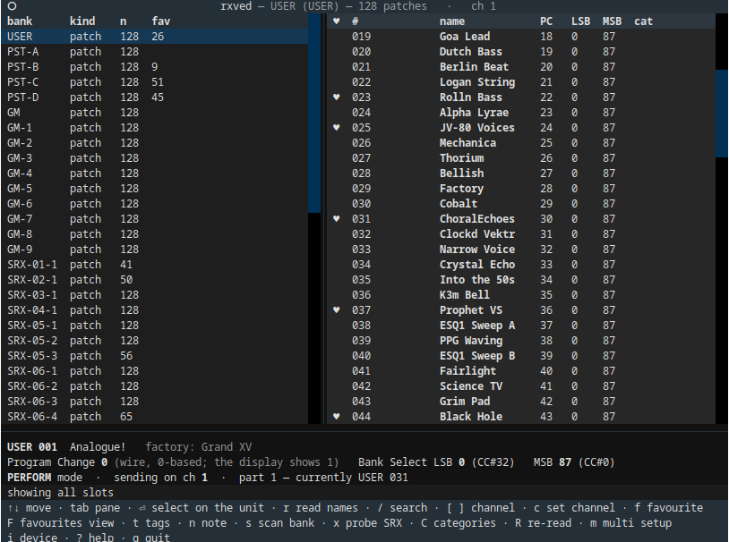
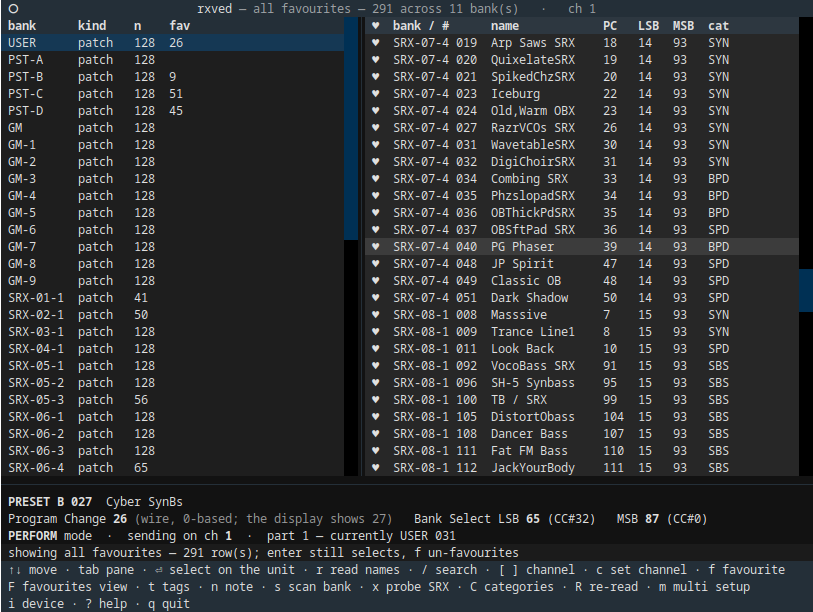
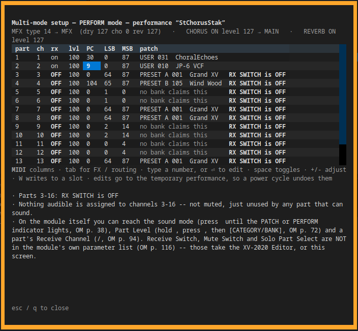

<!--
SPDX-License-Identifier: GPL-2.0-or-later
SPDX-FileCopyrightText: Copyright (C) 2026  rxved contributors
-->

# rxved

A terminal browser for the **Roland XV-2020**'s sounds.

Two panes: every bank the synth can be sent to on the left, that bank's
slots on the right, and on every row the three numbers that actually select
a sound — Program Change, Bank Select LSB and Bank Select MSB, in the order
a sequencer's MIDI track asks for them.

```
 bank       kind    n    fav      #    name          PC   LSB  MSB  cat  fav
 USER       patch   128           003  Folded Keys      2   65   87  DGT
 PST-A      patch   128  1        004  Static Pluck     3   65   87  DGT
▸PST-B      patch   128  1        005  Woven Bass       4   65   87  BS
 PST-C      patch   128           …
 GM         patch   128          ▸029  Iron Drone      28   65   87  SBS  *

 PRESET B 029  Iron Drone
 Program Change 28 (wire, 0-based; the display shows 29)
 Bank Select LSB 65 (CC#32)   MSB 87 (CC#0)
```

That last line is the point of the project. Everything else about a patch
can be found by listening to it; those three numbers cannot, and the manual
that lists them is 169 pages long and prints program numbers in a different
base from the one that goes on the wire.

Plus a local **favourites** database, so the patches you actually use stop
being something you rediscover.

rxved is mostly a **browser**. It edits the temporary performance, and it
can save one into a user performance slot — the only thing in it that can
destroy something, and fenced accordingly. It does not edit or store
patches.

---

## Support this project

rxved is free software and always will be. Nothing is behind a paywall, no
feature is withheld, and none of what follows changes that.

But if it has been useful — if it saved you an evening of mapping zones
by hand, or got a library onto a machine that had no way of reading it, or
**best of all, if it has your vintage instrument switched on and in use more often
than it was, and you are having more fun with it** — then please consider
supporting the work.

**Because here is what it has actually cost:**

- **Real machines on a real bench.** Much of what these tools know about these
  formats was measured on hardware rather than read anywhere, because for most
  of it there is nowhere to read it. That needs the machines — the instruments
  themselves — and it puts hours of wear on hardware that has been locked up and
  recovered more than once in the course of it. Some of these instruments were
  bought specifically to add and verify a format; the others were already here,
  because the person doing this is a vintage instrument enthusiast first and the
  projects exist because the instruments were in the room.
- **Dozens — realistically hundreds — of hours of human time.** Format
  reverse-engineering is slow: measure, be wrong, measure again. A single
  parameter law in this README can represent an evening at the bench.
- **AI assistance, which is a paid service**, used heavily throughout and not
  cheap at this volume.

**This is support, not a donation — and the distinction is a legal one, not a
turn of phrase.** The maintainer is based in Germany, where payments like these
are *not* `Spenden` in the tax sense: they count as **taxable income** for the
recipient and are **not tax-deductible** for the giver. So this section is
titled *Support*, deliberately, and no receipt for tax purposes can be issued.
(That is a statement of how it is handled here, not tax advice.)

If the project saved you the work, you can support it through
**[GitHub Sponsors](https://github.com/sponsors/lentferj)** — the *Sponsor*
button at the top of the repository. Payment is handled entirely by GitHub and
Stripe, so bank and tax details are never handed to the person paying.

**Support is not expected, and it is not the only currency.**

- **Bug reports** — ideally with the bank, preset or disk image that produced
  them. A tool's failures are usually specific to one file rather than
  general, and without that file they are very hard to reproduce.
- **Confirmations from hardware that is not on this bench**, which matters more
  here than for a single-machine tool. These tools write for whole *families*
  of instruments, and the bench holds only a subset. Whether a variant accepts
  what we write is genuinely unknown, and several notes say "on this unit" for
  that reason. A "loads fine here too", or a "no, mine refuses it", is worth a
  great deal.
- **Corrections to the reverse-engineering notes.** The wrong turns are
  recorded next to the findings in `docs/RESOLUTION_NOTES.md` — retractions
  included, because a finding that was withdrawn is as useful as one that
  stood. If any of it is wrong in a way that is still costing someone time,
  saying so improves the record.

---

## AI assistance & human authorship

rxved was built by its human author together with AI assistance. The
**ideas, the project vision, and every feature** came from the human author;
AI assisted with **writing the code and analyzing the binary formats**.
Crucially, the **reverse engineering rests on hands-on human work** — all testing
and verification on real hardware, creating the reference images/banks on those
instruments (disk saves, SysEx probes), and aural A/B comparison of presets —
which is what makes the results correct.
Full account in [DISCLAIMER.md](DISCLAIMER.md).

---

---

## ⚠️ Use at your own risk — back up first

 is provided **as is, with absolutely no warranty and no liability**
for data loss or **hardware damage**. You assume all risk. Full terms:
[DISCLAIMER.md](DISCLAIMER.md).

Before you use this software, **make good, current backups of all your files** —
and of any existing banks on your instrument and storage media. These tools can
write to hardware and storage media; a mistake, a bug, or untested output could
overwrite or corrupt data, or be rejected by hardware. Always test on a spare
unit or emulator **before** connecting irreplaceable equipment.

---

## What it does

rxved is a terminal browser for the Roland XV-2020 that displays the three numbers that actually select a sound — Program Change, Bank Select LSB and MSB — on every row, plus a local favourites database and a multi-mode editor for the temporary performance.



- **A send channel, because Bank Select and Program Change are per
  channel.** Which channel you send on decides what a select actually hits,
  and the synth never volunteers that: in Patch mode only the Patch Receive
  Channel selects anything, and in Performance mode each of the 16 parts has
  its own channel and its own patch — several parts may share one, in which
  case a Program Change there moves all of them. rxved reads the synth's
  mode, its two receive channels and every part's state, shows what is
  currently on the channel you are aiming at, and re-reads it whenever you
  change channel or select something.
- **Every bank the XV-2020 addresses**: USER, Preset A–D, GM2 and its nine
  variation banks, the internal and GM2 rhythm sets, all three performance
  banks, and every SRX expansion board from SRX-01 to SRX-12 — 55 banks and
  just under 5000 addressable slots (4612 of them patches). SRX-13 to
  SRX-98 are not in the table: SN 132 lists them, but it is a guide to the
  whole SRX series across every host that takes one, and none of them names
  the XV-2020. See `docs/RESOLUTION_NOTES.md` §"SN 132 lists boards this
  machine cannot play".
- **Names**, from two sources kept deliberately distinct: the printed lists,
  and what the synth itself says. A name read from the hardware is shown in
  bold; one that *disagrees* with the printed list gets a `*`.

  The `*` is worth a glance exactly when it is rare — somebody saved over
  slot 42, and the marker says so. Once **nothing** in a bank agrees, the
  marker goes: the printed list describes a bank as it shipped, so if the
  machine disagrees everywhere, that description is history and marking all
  128 rows tells the eye nothing. Measured on real hardware, a USER bank
  somebody had been working in: 128 of 128 disagreeing, with only slot 128
  left holding the factory `INIT PATCH`. The factory name is not lost — it
  moves to the detail line for whichever slot is highlighted.
- **Read names off the synth.** `r` reads a USER bank directly — genuinely
  read-only, nothing is selected, the instrument keeps playing whatever it
  was playing. The three writable banks (`USER`, `R-USER`, `P-USER`) are
  also re-read in the background at every startup, and what they say is
  kept in `live-names.json` beside the favourites database — so the browser
  opens showing your patches rather than the factory list, and only the
  highlight follows the hardware. Override the path with `--live-names`.
  `rxvcli` shares the file: `rxvcli read USER` caches what it reads, and
  `list`, `find` and `fav` report the cached names.
- **Scan a bank.** `s` learns preset and SRX names the only way they can be
  learned: by selecting each slot and reading back. This **plays the
  instrument**, and asks first.

  It only works in **PATCH** mode, and rxved refuses rather than guessing:
  in any other mode a program change does not move the patch that gets read
  back, so the scan would report the patch the synth is currently sitting on
  once per slot. That is not hypothetical — it is what an XV-2020 in
  PERFORM mode did here, answering all 128 reads with `Cutter Clav` (its
  current patch) while rxved dutifully wrote it down as 128 names. If the
  name never changes, the scan gives up after four slots and says why, and
  puts the synth back where it found it.
- **Find a fitted SRX board.** `x` probes for it, for boards Roland
  documented after rxved's table was written.
- **Favourites**, with ratings, tags and notes, in a SQLite database in the
  platform's own application-data directory — so a `git clean` in a checkout
  cannot take it:

  

  | | |
  |---|---|
  | Linux / BSD | `$XDG_DATA_HOME/rxved/favorites.db`, else `~/.local/share/rxved/favorites.db` |
  | macOS | `~/Library/Application Support/rxved/favorites.db` |
  | Windows | `%LOCALAPPDATA%\rxved\favorites.db` |

  Windows uses Local rather than Roaming on purpose: a roaming profile
  copies files wholesale at logon and logoff, and a SQLite database caught
  mid-copy — or opened from two machines against one synced file — is a
  known way to corrupt one. Override any of it with `--favorites`.
- **A CLI** (`rxvcli`) for everything, most of which needs no synth at all.
- **Multi-mode setup** (`m`) — all 16 Performance Parts editable, with a report on why any channel is silent.

  

  The one screen that writes. It shows every Performance Part — its MIDI
  settings and its effects routing — and underneath, a report on why any
  channel makes no sound.

  That report exists because the obvious answer is usually wrong. In PATCH
  mode the synth is single-timbral and the parts are not in use at all, so
  fifteen channels are silent with every part parameter reading perfectly
  normal. Solo Part Select silences fifteen parts from one byte nowhere near
  any of them. And a channel no audible part listens on is not a muted
  channel. The report tells these apart.

  Type a number straight into a numeric cell, `⏎` edits the cell under the
  cursor, `space` toggles a switch, `+`/`-` adjust. **Edits go to Temporary
  Performance — the edit buffer, not a stored performance — and a power cycle
  undoes them.** Nothing is written to a stored slot unless you ask for it
  with `W`, which backs up whatever is in the slot first. Each edit is read
  back and the row shows what the synth reports, not what was sent.

  This matters on an XV-2020 specifically: it is a half-rack module with a
  three-digit LED, and OM p. 116 lists what its four controls can reach.
  Receive Switch, Mute Switch and Solo Part Select are **not** on that list —
  without the editor or SysEx there is no way to see or change them at all.

  `tab` cycles the middle columns through four sets — **MIDI** (ch, rx, lvl,
  PC, LSB, MSB), **FX / routing** (mute, dry, cho, rev, out, mfx), **receive
  switches** (rxPC, rxBS, bend, mod, vol, hold) and **tone** (pan, oct, crs,
  fin, bend, mono, lo, hi). The patch name and the silence verdict stay in all
  four.

  Pan, octave and the two tunes are stored **biased by 64** — the wire byte is
  not the number the manual prints — so they are shown as the manual prints
  them and converted in one place. Key ranges show note names (`C4`), not the
  raw note number. Because `-` steps down, a negative value is typed by
  pressing `⏎` first: that pre-selects the current value so the first
  keystroke replaces it. Above the table, the performance's
  MFX type and routing, chorus and reverb.

  The receive switches are the ones that matter most to rxved, and they are
  per **MIDI channel**, not per part (OM p. 74 marks them `+` where the
  per-part parameters are `#`). **rxBS off is the nasty one**: the Bank Select
  bytes are dropped and the Program Change still lands, so a select appears to
  work and puts the part on the wrong patch. rxPC off means a select does
  nothing at all. Neither produces any response from the synth, so nothing
  downstream can detect it — the report names the channels.

  Output-assign values this model ignores are shown with a star (`6*`) rather
  than hidden — a performance written on an XV-5080 can carry one, and that
  explains a silent part where a blank would not.

  **Moving the cursor never sends anything.** That is enforced by a test, not
  just by intent: it is the property that decides whether you can leave this
  open next to a running sequencer.

## Install

Clone both repositories side by side:

```sh
# Choose a parent directory, e.g. ~/git-repos
mkdir -p ~/git-repos && cd ~/git-repos
git clone https://github.com/lentferj/rxved.git
git clone https://github.com/lentferj/vinsynlib.git
cd rxved
python3 -m venv --system-site-packages .venv
.venv/bin/python -m pip install --upgrade pip
.venv/bin/pip install --no-deps -e ../vinsynlib
.venv/bin/pip install -e .
```

Two checkouts, side by side — this project (**rxved**) and **vinsynlib**, the shared base
of this family of terminal instrument tools: the settings cache, the
favourites database, the keymap and legend, the command line and the port
listing. vinsynlib is **not on PyPI**, so it is installed from the sibling
checkout above, and installed *first* so that the second command finds the
requirement already satisfied. `--no-deps` because its dependencies are this
project's too, and a second copy of `textual` in the same venv is a version
skew to diagnose somewhere else. `uv sync` reads the path from
`[tool.uv.sources]` in `pyproject.toml` instead: the checkout has to exist,
but neither `pip` line is needed.
Needs Python 3.11+, `python-rtmidi` and `textual`. On Linux you also need an
ALSA sequencer — `rxvcli ports` will tell you plainly if there isn't one.

The `pip install --upgrade pip` line is not optional housekeeping. A venv
is seeded with whatever `ensurepip` carries, which on a distribution
interpreter can be old enough to have published advisories — Debian 11
ships pip 23.0.1, which has seven. `make audit-deps` audits the venv's own
site-packages, so a stale pip there fails `make check` on packaging
advisories that have nothing to do with rxved. CI upgrades pip for the
same reason.

`--system-site-packages` is deliberate: `python-rtmidi` needs ALSA headers
that are awkward to build in a bare venv. The cost is that `pip-audit`
sees the whole system site-packages, so `make audit-deps` scopes it with
`--path` — see `docs/CHECKS.md`.

It also means pip reads the metadata of every package on the system, so a
distribution's own broken metadata shows up as a warning in the middle of
rxved's install. On Debian that is `Send2Trash`, whose `Requires-Dist`
lines are not valid PEP 508:

```
WARNING: Error parsing dependencies of send2trash: Expected matching
RIGHT_PARENTHESIS for LEFT_PARENTHESIS, after version specifier
    sys-platform (=="darwin") ; extra == 'objc'
```

It is safe to ignore: nothing rxved depends on requires it, the extra it
belongs to is macOS-only, and the install finishes normally either way.

For development, add the checks:

```sh
.venv/bin/pip install -e '.[dev]'
```

One consequence worth knowing, because it looks like a broken install:
`--system-site-packages` means pip accepts a requirement as already
satisfied when your *user* site-packages (`~/.local`) has that exact
version, installs nothing, and writes no console script. So `.venv/bin/pytest`
can be missing while `pip list` cheerfully reports pytest present. `make
check` calls every tool as `python -m <tool>`, which resolves either way —
running `.venv/bin/pytest` by hand is what does not work.

And `tools/read_marked_list.py` additionally needs numpy and Pillow:

```sh
.venv/bin/pip install -e '.[tools]'
```

## Run

The install puts the two commands in the venv, so put that on `PATH`
first — otherwise the shell answers `rxved: command not found`:

```sh
source .venv/bin/activate          # PowerShell: .venv\Scripts\Activate.ps1
```

Or skip activation and spell out the path: `.venv/bin/rxved`.

```sh
rxved --demo          # built-in demo synth; opens no MIDI ports
rxved                 # the XV-2020 remembered in config.toml
rxved --scan          # probe every port again and update config.toml
rxved --port "Roland XV-2020:Roland XV-2020 MIDI 1 68:0"
```

**Plain `rxved` does not scan.** It opens the port recorded in
`config.toml` and sends one Identity Request to it — about 0.15 s. Only if
nothing is recorded yet does it probe every port, and then it saves the
answer. The sweep is the slow path (18 s and thirty Identity Requests on a
machine with thirty MIDI ports, one to every device on the chain) and there
is no reason to pay it on every launch to learn something already known.

So the port is found once and then believed. When the synth moves — and USB
re-enumeration renumbers the ALSA client, so `MIDI 1 68:0` becomes
`MIDI 1 72:0` when you move it to another USB socket — the remembered name
stops answering, and rxved says so and stops:

```
error: nothing answered an Identity Request on the remembered port
  Midi Through:Midi Through Port-0 14:0
which config.toml says is the XV-2020. It may be powered off, on a
different port now (USB renumbers MIDI ports), or busy. Re-run with
--scan to probe every port and update config.toml.
```

That is deliberate: a stale guess is reported rather than papered over with
a silent sweep, so a launch never quietly takes the slow path for a reason
you did not ask about. `--scan` is the way out, and it rewrites the file.

The probe matches the XV-2020's family *number* — not just its family code,
which it shares with the rest of the XV/JV line — so it will not adopt an
XV-3080 on the same chain. It keeps going after the first answer rather than
taking it, because two XV-2020s on one chain is worth refusing over.
`--port` overrides both, and asks nothing: it is the port, unverified.

### Keys

| | |
|---|---|
| arrows, `tab` | move; `tab` switches pane |
| `enter` | select this slot **on the synth** — it will sound |
| `f` | favourite this slot |
| `t` / `n` | tags / note (on a favourite) |
| `/` | search names |
| `r` | read this bank's names from the synth (`USER`/`R-USER`/`P-USER`; read-only) |
| `s` | scan this bank by selecting every slot (**plays the synth**, PATCH mode only) |
| `x` | probe for a fitted SRX board (**plays the synth**) |
| `F` | cycle: all slots → this bank's favourites → every favourite |
| `C` | filter by category (multi-select), on top of whichever view is showing |
| `[` / `]` / `c` | previous / next send channel, or type one |
| `R` | re-read the synth's mode, channels and all 16 parts |
| `m` | multi-mode setup: all 16 parts, **editable**, and why a channel is silent |
| `W` | (in `m`) write the edit buffer to a user performance slot — **destructive** |
| `i` / `?` / `q` | device identity / help / quit |

### Command line

```sh
rxvcli ports                      # MIDI ports, and which look like an XV
rxvcli banks                      # the whole bank table
rxvcli list PST-B                 # one bank's slots
rxvcli find "bass" --kind patch   # search names
rxvcli resolve 87 65 28           # what does this MSB/LSB/PC select?
rxvcli status                     # ask the synth who it is
rxvcli channels                   # what each MIDI channel currently selects
rxvcli multi                      # all 16 parts, and why a channel is silent
rxvcli read USER                  # read USER names (read-only)
rxvcli select PST-B:29            # select it on the synth
rxvcli scan PST-A --yes           # learn a preset bank's names (plays it)
rxvcli probe-srx --yes            # find the fitted board (plays it)

rxvcli perf-backup --slot 5       # read a performance to a file (read-only)
rxvcli perf-verify --slot 5 --yes # prove a user slot is writable, unchanged
rxvcli perf-store --slot 5 --yes  # save the edit buffer to that slot
                                  #   **DESTRUCTIVE** -- backs it up first
rxvcli perf-restore FILE --slot 5 --yes   # **DESTRUCTIVE**
rxvcli perf-list                  # backups on disk

rxvcli fav --add PST-B:29 --tags "bass, trance" --note "for the intro"
rxvcli fav --tag bass
rxvcli tags
```

`ports`, `banks`, `list`, `find`, `resolve`, `fav`, `tags` and `perf-list`
construct no bridge and open no port — they work on a headless box and
while somebody else is using the hardware. `scan` and `probe-srx` refuse to
run without `--yes`, because a shell is exactly where a recalled history
line fires something you did not mean to fire; `perf-verify`, `perf-store`
and `perf-restore` require it for the same reason.

Global options go **before** the subcommand — `rxvcli --demo multi`, not
`rxvcli multi --demo`. `--port` and `--scan` work the same way and mean the
same thing here as in `rxved`: without them, the port recorded in
`config.toml` is used and nothing else is probed.

## Patch names are not included

rxved does not redistribute Roland's patch-name catalogs. The bank numbers
and MIDI select values are generated by rxved, but names are read locally
from your own Roland manuals/editor files, or from the synth itself:

```sh
python3 tools/extract_catalog.py \
    --srx SRX-01=SRX-01_OM.pdf --srx SRX-02=SRX-02_OM.pdf --srx SRX-03=SRX-03_OM.pdf \
    --srx SRX-04=SRX-04_OM.pdf --srx SRX-05=SRX-05_OM.pdf --srx SRX-06=SRX-06_OM.pdf \
    --srx SRX-07=SRX-07_OM.pdf --srx SRX-08=SRX-08_OM.pdf --srx SRX-09=SRX-09_OM.pdf \
    --srx SRX-10=SRX-10_OM.pdf --srx SRX-11=SRX-11_OM.pdf --srx SRX-12=SRX-12_OM.pdf
```

All SRX Owner's Manuals are available for download from Roland's official support website:
- SRX-01: https://www.roland.com/global/support/by_product/srx-01/owners_manuals/
- SRX-02: https://www.roland.com/global/support/by_product/srx-02/owners_manuals/
- SRX-03: https://www.roland.com/global/support/by_product/srx-03/owners_manuals/
- SRX-04: https://www.roland.com/global/support/by_product/srx-04/owners_manuals/
- SRX-05: https://www.roland.com/global/support/by_product/srx-05/owners_manuals/
- SRX-06: https://www.roland.com/global/support/by_product/srx-06/owners_manuals/
- SRX-07: https://www.roland.com/global/support/by_product/srx-07/owners_manuals/
- SRX-08: https://www.roland.com/global/support/by_product/srx-08/owners_manuals/
- SRX-09: https://www.roland.com/global/support/by_product/srx-09/owners_manuals/
- SRX-10: https://www.roland.com/global/support/by_product/srx-10/owners_manuals/
- SRX-11: https://www.roland.com/global/support/by_product/srx-11/owners_manuals/
- SRX-12: https://www.roland.com/global/support/by_product/srx-12/owners_manuals/

(On each page, click “Owner’s Manual”, then agree to the license to download the PDF.)

That reads your own copies of Roland's XV-2020 Editor for Windows, the
Owner's Manual and the Patch Listing, and writes `xv/data/catalog.json`,
which is gitignored. It currently produces **3856 names across 55 banks**: the XV-2020's own
1045, plus every expansion board whose owner's manual you point `--srx` at —
2637 patches and 174 rhythm sets across SRX-01 to SRX-12, with categories,
each split across the LSB pages that select it.

Two weaker routes exist for boards with no manual: `--srx-list` reads a
names-only Faxback sheet, `--srx-names` a hand-written table. Prefer the
manual: it brings categories, and replacing the weaker sources with manuals
found three parsing defects that neither weaker source could reveal on its
own (RESOLUTION_NOTES §11).
Pass `--editor`, `--manual` and `--patch-list` if yours are somewhere other
than the defaults.

Without it, rxved still works — you get numbers instead of names, and `r`
and `s` fill names in from the synth itself.

The editor binary is preferred over the PDFs wherever it reaches: it stores
names as fixed-width 12-byte records, the same width the device uses, so
they come out byte-exact rather than with the apostrophes a PDF text layer
mangles. Its GM records carry their own MSB/LSB/PC, so that mapping is read
rather than inferred. See `docs/RESOLUTION_NOTES.md` §3.

## Reading a marked-up printout

If you print a patch list, go through it at the keyboard with a highlighter
and want the result in software afterwards:

```sh
python3 tools/read_marked_list.py scan.pdf --bank 1=PST-C --bank 2=PST-D --apply
```

It writes a text list beside the PDF and, with `--apply`, adds the rows to
the favourites database. Names come from the local catalog rather than from
OCR of the scan, so they are exact.

The marker fades, and a photocopier and a scanner each fade it further, so
detection measures how far blue runs ahead of red rather than matching a
colour — black text and white paper are both neutral, and any blue lift at
all is the highlighter. Rows that score just under the line are listed rather
than dropped quietly; in practice they are rows sitting directly beneath a
marked one, catching the top edge of its mark.

## How much of this is verified?

**Read `DISCLAIMER.md` before trusting a byte offset.** Short version:

- **Verified** against a real XV-2020 on 2026-09-11: port discovery, the
  Identity Request/Reply, the device-ID numbering, the RQ1/DT1 round trip
  (which confirms the frame layout, model ID, base-128 addressing and the
  checksum rule together), all 128 User Patch addresses, the two System
  Common receive-channel bytes, the Setup block, all 16 Performance Parts,
  and — sent and read back — the Bank Select triples for USER, PST-A, PST-B,
  PST-D and GM, **including the 0-based/1-based split**.
- **Not verified**: rhythm-set and performance triples, the whole SRX
  table, and both timing constants — which are *guesses*, labelled as such
  in the code.

One bug is worth knowing about because of how it hid: `device_id_byte()`
originally accepted "either" a panel number (17–32) or a wire byte
(`0x10`–`0x1F`), and those ranges overlap for every value from 17 to 31.
Panel "17" became `0x11`, every request went to a device that was not there,
and the XV-2020 answers a wrongly addressed request with **silence** —
indistinguishable from powered-off, wrong-port or busy. Every synthetic test
passed, because they all shared the same wrong convention. It took one read
against real hardware to find. `DISCLAIMER.md` has the full account.

## Development

```sh
make check                       # everything: lint, types, tests, audit
```

See **Development checks** below.

Project layout follows the author's sibling **eosed** and **s3ked**
projects — a device-domain package and a UI package that knows nothing about
MIDI:

- `xv/messages.py` — the wire codec. RQ1/DT1, base-128 address arithmetic,
  the checksum that covers the address as well as the data.
- `xv/banks.py` — what MSB, LSB and Program Change select. The table the
  whole project exists to display.
- `xv/catalog.py` — names, and the printed-versus-live distinction.
- `xv/bridge.py` — MIDI transport, throttling, discovery, the reads.
- `rxved/app.py` — the Textual TUI. `rxved/cli.py` — the CLI.
- `rxved/favorites.py` — the favourites database.
- `rxved/demo.py` — a synth stand-in that opens no ports.

`TODO.md` is what's open; `docs/RESOLUTION_NOTES.md` is how each thing was
resolved and where every transcribed number came from.

### Development checks

The same two checkouts as [Install](#install) above, plus the pinned
toolchain and the git hook:

```sh
.venv/bin/pip install -e '.[dev]'
pre-commit install

make check            # lint, types, tests, audit — fails on any error
```

The checkouts therefore sit beside each other, which is how the family is
arranged:

```
git-repos/
  rxved/         <- this one
  vinsynlib/     <- the shared base
  emorphed/  ensqsqed/  s3ked/  ...
```

`make check` is the whole pipeline; each piece also runs on its own
(`make help` lists them all):

| | |
|---|---|
| `make lint` | **ruff** — lint. Replaces flake8, isort, black and pyupgrade |
| `make format` | **ruff** — format in place, then apply safe lint fixes |
| `make format-check` | **ruff** — is anything unformatted? Runs in `check` |
| `make typecheck` | **mypy** — non-strict; `typecheck-strict` counts per module |
| `make test` | **pytest** + **pytest-cov** — term-missing, no threshold yet |
| `make audit` | **pip-audit**, **vulture**, **deptry**, **detect-secrets** |

The same checks run as pre-commit hooks on the files you touched, pinned
to the same tool versions as the `dev` extra so a hook and `make check`
can never disagree.

Everything is configured in `pyproject.toml`. **No existing finding was
mass-fixed to get here**: 856 ruff findings and 222 mypy findings are
suppressed with a reason written beside each one, scoped so that
anything *new* still fails. `docs/CHECKS.md` lists every suppression and
why it exists, and is the place to look before adding a rule or removing
one.

Formatting is ruff-format's and is enforced — `make format-check` runs in
`check`, and there is a hook for it. It landed as its own commit rather
than mixed into a code change, which is the only way a formatter this
opinionated can be adopted without losing whatever rode along with it.

One thing to know before you trust the green: in a venv built with
`--system-site-packages`, `pip-audit` ignores **three setuptools
advisories**. That copy comes from the OS and cannot be upgraded — a
newer setuptools needs a newer `jaraco.functools`, and the system copy
wins over the venv's. It also skips editable distributions, which is how
`rxved` and `vinsynlib` are both installed — neither is on an index, so
there is nothing for it to resolve against. CI builds a clean venv,
upgrades pip and setuptools, and suppresses no advisories at all.
Reasoning is in `docs/CHECKS.md`.

Python 3.13 is not claimed and not tested: `python-rtmidi` has no cp313
wheel, so installing there means a source build.

shellcheck and shfmt are wired into pre-commit but currently match
nothing: rxved has no shell scripts, and `make` calls the tools directly.

CI runs the same `make check` on **Linux, Windows and macOS** (`.github/workflows/checks.yml`,
Python 3.11 and 3.12, six jobs), plus a job that runs every pre-commit
hook over every file.

## License and third-party sources

GPL-2.0-or-later. Full text in `COPYING`; attributions in `LICENSE`.

| What | Source |
|---|---|
| SysEx frame layout, model ID, checksum, address map | XV-2020 Owner's Manual (Roland Corporation, 2003), pp. 140–146 |
| Internal Bank Select map | Same manual, pp. 40–41 and p. 136 |
| SRX Bank Select allocation, all boards | Roland Supplemental Note SN 132 v3.00 (2007), "Selecting Internal and SRX-Series Sounds Via MIDI" |
| Patch / rhythm / performance names | Roland's XV-2020 Editor, Owner's Manual and Patch Listing — read locally, **not distributed** |
| Transport layer | Ported from the author's s3ked, eosed, k2kremote and mpc2emu, all GPL-2.0-or-later |
| Settings cache, favourites store, keymap, legend, parser, port listing | **vinsynlib**, this family's shared base, GPL-2.0-or-later — assembled from the copies in emorphed, ensqsqed, kwsed, nanosyned, p2ked, s3ked and x5ded, plus the defect fixes three of those copies had drifted into |

Roland, XV-2020, SRX, JV and Fantom are trademarks of Roland Corporation.
This is an independent project, not endorsed by or affiliated with Roland,
and uses those names only to say what hardware it talks to.

rxved was written by Jan Lentfer with the assistance of AI coding assistance;
see `DISCLAIMER.md` for who did what.
